# 基金股票智能分析系统 - 毕业设计技术指导文档

基于现有技术栈和Hadoop大数据处理需求，本文档提供基金股票智能分析系统毕业设计的完整实施方案，重点突出大数据技术的应用，涵盖技术选型、系统设计、实现步骤、论文结构等核心内容，助力顺利完成毕业设计。

> **重要更新**: 本文档已从"16周论文+系统"计划重构为"1周系统先行+论文素材同步积累"模式。下面"实现步骤"部分提供1周冲锋计划，同时保留完整的论文结构供后续撰写参考。

---

# 一、完整技术栈与软件规划

## 1. 技术栈架构

```
├── 数据采集层
│   ├── Python 3.8+ (Anaconda环境)
│   ├── Scrapy/Selenium (网页爬虫)
│   ├── Requests/API调用
│   ├── 东方财富/同花顺/新浪API
│   └── Git (版本控制)
│
├── 大数据处理层 (核心)
│   ├── Hadoop 3.x (HDFS + YARN)
│   ├── MapReduce (离线计算)
│   ├── Hive 3.x (数据仓库)
│   ├── Spark 3.x (实时计算)
│   └── Sqoop/Flume (数据迁移)
│
├── 数据存储层
│   ├── HBase 2.x (NoSQL)
│   ├── MySQL 8.0 (关系型)
│   ├── Redis 7.x (缓存)
│   └── HDFS (分布式文件)
│
├── 数据处理与分析层
│   ├── Java 11 (Spring Boot)
│   ├── Python (数据分析)
│   ├── Pandas/NumPy (数据计算)
│   ├── TA-Lib (技术指标)
│   └── 缠论分析算法
│
├── 应用服务层
│   ├── Spring Boot 2.7
│   ├── MyBatis Plus
│   ├── Spring Security
│   └── WebSocket
│
├── 前端展示层
│   ├── Vue 3 + TypeScript
│   ├── Element Plus
│   ├── ECharts 5
│   ├── Axios
│   └── Vue Router
│
├── AI对话层
│   ├── RESTful API调用
│   ├── Python Flask/FastAPI
│   └── 多AI结果融合
│
└── 开发工具
    ├── IntelliJ IDEA (后端)
    ├── PyCharm (Python/爬虫)
    ├── DataGrip (数据库)
    ├── VS Code (前端)
    └── Docker (环境)
```

## 2. 软件使用说明

|软件工具|用途|对应模块|
|---|---|---|
|PyCharm|Python开发，爬虫脚本，数据分析|数据采集、AI对话、算法实现|
|DataGrip|多数据库管理 (MySQL/Hive/HBase)|数据库设计、SQL查询优化|
|MySQL|业务数据存储，用户管理|用户、自选、配置数据|
|Anaconda|Python环境管理，数据分析库|数据清洗、机器学习|
|Git|版本控制，团队协作|代码管理，文档版本|
|IntelliJ IDEA|Java开发，Spring Boot项目|后端服务，Hadoop/Spark作业|

---

# 二、系统架构图（可直接用于论文）

## 1. 整体系统架构图

绘制"基于Hadoop的大数据金融分析系统"架构图，要求如下：

- **数据源层（顶部）**：同花顺API、东方财富API、新浪财经API、开源数据源、网络爬虫

- **数据采集层**：Python爬虫集群、API调用模块、数据校验模块、实时/批量采集调度

- **大数据存储层（核心）**：
  - HDFS分布式文件系统（原始数据区 /raw、清洗数据区 /cleaned、分析结果区 /results）
  - HBase列式数据库（实时数据）
  - Hive数据仓库（历史数据）
  - MySQL业务数据库
  - Redis缓存数据库

- **大数据计算层**：
  - Hadoop MapReduce（离线计算，负责历史数据分析）
  - Spark Streaming（实时计算，负责实时行情处理）
  - Spark MLlib（机器学习，负责预测模型训练）
  - 缠论分析引擎、量化分析引擎

- **应用服务层**：
  - Spring Boot微服务（用户服务、自选服务、行情服务、分析服务、AI对话服务）
  - RESTful API网关、WebSocket推送服务

- **前端展示层**：Vue.js SPA应用、响应式设计、可视化图表、AI对话界面

- **监控与管理层**：系统监控、作业调度、日志管理、告警系统

补充要求：用不同颜色区分各层，箭头表示数据流向；左下角标注：数据流方向：采集 → 存储 → 计算 → 服务 → 展示

## 2. 大数据处理流程详细架构图

绘制"大数据处理技术实现"详细架构图，要求如下：

### 左侧：数据处理管道
1. **数据获取**：定时爬虫任务、实时API调用、数据校验机制
2. **数据清洗（PySpark作业）**：缺失值处理、异常值检测、格式标准化、去重处理
3. **数据存储策略**：原始数据 → HDFS、结构化数据 → Hive、实时数据 → HBase、热点数据 → Redis
4. **数据分析计算**：MapReduce作业（历史数据分析）、Spark Streaming（实时指标计算）、Hive SQL（数据仓库查询）、自定义算法（缠论分析）
5. **结果输出**：分析结果存储、API服务提供、前端数据推送

### 右侧：大数据组件部署
- Hadoop集群（3节点）：NameNode、DataNode × 3、ResourceManager
- Spark集群：Master节点、Worker节点 × 2
- HBase集群、Hive元数据存储、ZooKeeper集群

补充要求：中间连接显示各个组件间的数据交互；底部标注技术版本：Hadoop 3.3, Spark 3.2, Hive 3.1, HBase 2.4

---

# 三、实现步骤（1周MVP冲锋版）

> 本节将原16周计划映射为1周高强度冲刺。核心策略：**MVP先通、脚手架先行、Core功能只做1条完整链路、模块接口优先于实现**。

## 1周 → 16周 映射总览

```mermaid
gantt
    title 16周计划 → 1周冲锋映射
    dateFormat  HH:mm
    axisFormat  %H:%M
    
    section Day 1 (对应 W1-W2)
    环境搭建与Docker就绪              :env, 00:00, 04:00
    Spring Boot骨架生成              :sb, 02:00, 04:00
    
    section Day 2 (对应 W3-W4)
    MySQL+Hive建表                   :db, 00:00, 03:00
    数据采集脚本 (东方财富API)        :collect, 03:00, 05:00
    
    section Day 3 (对应 W5-W6)
    MapReduce+Spark脚本              :bigdata, 00:00, 06:00
    后端CRUD+分析API                  :api, 03:00, 05:00
    
    section Day 4 (对应 W7-W8)
    缠论分析算法                      :chan, 00:00, 04:00
    技术指标计算(TALib)               :tech, 02:00, 04:00
    
    section Day 5 (对应 W9-W10)
    前端Vue项目初始化+布局             :vue1, 00:00, 04:00
    K线图+行情展示                    :vue2, 03:00, 05:00
    
    section Day 6 (对应 W11-W14)
    AI对话服务集成                    :ai, 00:00, 05:00
    前后端联调+业务流程打通            :integ, 03:00, 05:00
    
    section Day 7 (对应 W15-W16)
    系统测试与修复                    :test, 00:00, 04:00
    文档完善+演示准备                 :doc, 03:00, 05:00
```



## 详细每日计划

### 🗓 Day 1 — 环境基石（对应原W1-W2）

| 时间段 | 任务 | 具体操作 | 产出 |
|:---:|:---|:---|:---|
| 09:00-10:00 | Docker环境 | 编写 `docker/docker-compose.yml`（Hadoop+Namenode+Datanode+Hive+MySQL） | 可启动的环境 |
| 10:00-12:00 | 环境验证 | 启动 Docker，验证 HDFS/Hive/MySQL 联通 | `docker ps` 全部运行中 |
| 14:00-15:00 | 后端骨架 | 生成 Spring Boot 项目（Maven + MyBatis Plus + Spring Web） | `backend/pom.xml` + 基础骨架 |
| 15:00-17:00 | 数据库设计 | 设计 MySQL 表（user, stock, fund, watchlist, analysis_result） | SQL + Entity 类 |
| 17:00-18:00 | 前端初始化 | 初始化 Vue 3 项目（Vite + TypeScript + Element Plus + ECharts） | `frontend/` 可运行 |

**验收标准**：`docker ps` 有容器、`mvn compile` 通过、`npm run dev` 能打开页面

### 🗓 Day 2 — 数据通道（对应原W3-W4）

| 时间段 | 任务 | 具体操作 | 产出 |
|:---:|:---|:---|:---|
| 09:00-11:00 | 数据采集 | 编写东方财富/新浪API采集脚本 (Python) | 实时行情+历史K线采集 |
| 11:00-12:00 | Hive建表 | 编写 Hive 建表 SQL（stock_basic, stock_daily_partitioned） | `bigdata-processing/hive/schema.sql` |
| 14:00-15:00 | 数据通道 | 数据写入 HDFS + Hive 外部表关联 | 数据通道打通 |
| 15:00-17:00 | 后端CRUD API | 实现 stock/fund/user/watchlist 的 RESTful API | `backend/src/main/java/...` |
| 17:00-18:00 | 前端布局 | 完成布局骨架 + 路由 + 菜单 | 可导航的管理界面 |

**验收标准**：`python data-collector/crawler/stock.py` 能采到数据、API 返回 JSON

### 🗓 Day 3 — 大数据处理（对应原W5-W6）

| 时间段 | 任务 | 具体操作 | 产出 |
|:---:|:---|:---|:---|
| 09:00-11:00 | MapReduce | 实现股票年收益率计算MR作业 | `StockYearlyReturn.java` |
| 11:00-12:00 | Hive SQL | 编写分析查询（日均价、涨跌幅统计） | 分析查询脚本 |
| 14:00-16:00 | Spark | 编写实时指标计算模板（PySpark） | `pyspark_realtime.py` |
| 16:00-18:00 | 分析API | 后端拓展分析接口（收益率、趋势、筛选） | 分析 Controller + Service |

**验收标准**：MR作业可执行并输出结果到 HDFS

### 🗓 Day 4 — 分析算法（对应原W7-W8）

| 时间段 | 任务 | 具体操作 | 产出 |
|:---:|:---|:---|:---|
| 09:00-11:00 | 缠论 | 实现分型/笔/线段/中枢识别算法 | `analysis-algorithms/chanlun/` |
| 11:00-12:00 | 缠论接口 | 缠论结果可视化接口（识别结果 → JSON） | 与后端对接 |
| 14:00-16:00 | 技术指标 | MA, MACD, KDJ, RSI, BOLL 计算 | `analysis-algorithms/technical/` |
| 16:00-18:00 | 量化模型 | 均线策略模板框架 | `analysis-algorithms/quantitative/` |

**验收标准**：能对某只股票数据计算出缠论分型点和常见技术指标

### 🗓 Day 5 — 前端冲锋（对应原W9-W12）

| 时间段 | 任务 | 具体操作 | 产出 |
|:---:|:---|:---|:---|
| 09:00-12:00 | K线图 | ECharts K线 + 成交量 + 均线叠加 | `views/Stock/StockDetail.vue` |
| 14:00-16:00 | 股票页面 | 列表/搜索/自选管理 | `views/Stock/StockList.vue` |
| 16:00-18:00 | 基金页面 | 净值走势 + 持仓分析 | `views/Fund/` |

**验收标准**：前端能展示实时K线图、技术指标叠画

### 🗓 Day 6 — AI + 集成（对应原W13-W14）

| 时间段 | 任务 | 具体操作 | 产出 |
|:---:|:---|:---|:---|
| 09:00-11:00 | AI服务 | Flask/FastAPI 封装 Kimi/DeepSeek API | `ai-service/app/` |
| 11:00-12:00 | AI接口 | 后端 AI 对话接口 + 多AI融合逻辑 | AIService + AIController |
| 14:00-16:00 | AI前端 | 聊天式交互界面 | `views/AIAnalysis/Chat.vue` |
| 16:00-18:00 | 全链路打通 | 采集→HDFS→Hive分析→后端API→前端展示 | 端到端验证 |

**验收标准**：用户在浏览器输入股票代码，能看K线图、技术指标，并能与AI对话

### 🗓 Day 7 — 收尾（对应原W15-W16）

| 时间段 | 任务 | 具体操作 | 产出 |
|:---:|:---|:---|:---|
| 09:00-12:00 | 测试修复 | 集成测试 + Bug 修复 | 所有URI可访问 |
| 14:00-16:00 | 文档完善 | README、API文档、部署文档 | `docs/` 全部文档 |
| 16:00-18:00 | 演示准备 | 关键界面截图+录制 + 模块化扩展点说明 | 演示素材 |

**验收标准**：全系统端到端可用、文档完整

---

# 四、代码示例（可直接用于论文）

## 1. 数据采集脚本 (Python)

```python
import requests
import pandas as pd
from hdfs import InsecureClient

class StockDataCollector:
    def __init__(self):
        self.hdfs_client = InsecureClient('http://localhost:9870', user='hadoop')
        
    def collect_real_time_data(self):
        """从多源获取数据"""
        # 东方财富API
        df_data = self.get_from_eastmoney()
        # 同花顺API
        ths_data = self.get_from_ths()
        # 整合数据
        return self.merge_data(df_data, ths_data)
    
    def save_to_hdfs(self, data, path):
        """保存到HDFS"""
        with self.hdfs_client.write(path) as writer:
            data.to_csv(writer, index=False)
```

## 2. 数据采集调度

使用crontab或Airflow调度，示例（crontab）：
```bash
0 */5 * * * python /opt/stock_crawler.py
```

## 3. Hive数据仓库

```sql
-- 创建Hive数据库
CREATE DATABASE IF NOT EXISTS stock_analysis;

-- 创建股票基本信息表
CREATE EXTERNAL TABLE IF NOT EXISTS stock_analysis.stock_basic (
    stock_code STRING COMMENT '股票代码',
    stock_name STRING COMMENT '股票名称',
    market STRING COMMENT '市场',
    industry STRING COMMENT '行业',
    listing_date STRING COMMENT '上市日期'
) COMMENT '股票基本信息表'
ROW FORMAT DELIMITED
FIELDS TERMINATED BY ','
STORED AS TEXTFILE
LOCATION '/user/hadoop/stock_data/basic';

-- 创建日K线数据表（分区表）
CREATE EXTERNAL TABLE IF NOT EXISTS stock_analysis.stock_daily (
    trade_date STRING COMMENT '交易日期',
    open_price DECIMAL(10,2) COMMENT '开盘价',
    high_price DECIMAL(10,2) COMMENT '最高价',
    low_price DECIMAL(10,2) COMMENT '最低价',
    close_price DECIMAL(10,2) COMMENT '收盘价',
    volume BIGINT COMMENT '成交量',
    amount DECIMAL(20,2) COMMENT '成交额'
) COMMENT '股票日K线数据表'
PARTITIONED BY (stock_code STRING, year INT, month INT)
ROW FORMAT DELIMITED
FIELDS TERMINATED BY ','
STORED AS PARQUET
LOCATION '/user/hadoop/stock_data/daily';
```

## 4. MapReduce计算示例（股票年收益率）

```java
public class StockYearlyReturn {

    public static class MapperClass 
        extends Mapper<Object, Text, Text, Text> {
        
        public void map(Object key, Text value, Context context) 
            throws IOException, InterruptedException {
            
            String[] fields = value.toString().split(",");
            String stockCode = fields[0];
            String date = fields[1];
            double closePrice = Double.parseDouble(fields[4]);
            
            // 提取年份
            int year = Integer.parseInt(date.substring(0, 4));
            
            context.write(
                new Text(stockCode + "-" + year), 
                new Text(date + "," + closePrice)
            );
        }
    }
    
    public static class ReducerClass 
        extends Reducer<Text, Text, Text, DoubleWritable> {
        
        public void reduce(Text key, Iterable<Text> values, Context context) 
            throws IOException, InterruptedException {
            
            List<PriceData> prices = new ArrayList<>();
            for (Text val : values) {
                String[] data = val.toString().split(",");
                prices.add(new PriceData(data[0], Double.parseDouble(data[1])));
            }
            
            // 按日期排序
            Collections.sort(prices);
            
            if (prices.size() > 1) {
                double firstPrice = prices.get(0).getPrice();
                double lastPrice = prices.get(prices.size()-1).getPrice();
                double yearlyReturn = (lastPrice - firstPrice) / firstPrice * 100;
                
                context.write(key, new DoubleWritable(yearlyReturn));
            }
        }
    }
}
```

## 5. Spark实时计算示例

```python
from pyspark import SparkContext
from pyspark.streaming import StreamingContext
from pyspark.sql import SparkSession
import talib
import numpy as np

# 创建Spark会话
spark = SparkSession.builder \
    .appName("StockRealTimeAnalysis") \
    .getOrCreate()

# 读取Kafka实时数据
df = spark.readStream \
    .format("kafka") \
    .option("kafka.bootstrap.servers", "localhost:9092") \
    .option("subscribe", "stock-realtime") \
    .load()

# 转换为DataFrame
stock_df = df.selectExpr("CAST(value AS STRING)") \
    .select(
        get_json_object(col("value"), "$.code").alias("stock_code"),
        get_json_object(col("value"), "$.price").alias("price"),
        get_json_object(col("value"), "$.volume").alias("volume"),
        get_json_object(col("value"), "$.timestamp").alias("timestamp")
    )

# 窗口计算
windowed_df = stock_df \
    .withWatermark("timestamp", "10 minutes") \
    .groupBy(
        window(col("timestamp"), "5 minutes", "1 minute"),
        col("stock_code")
    ) \
    .agg(
        avg("price").alias("avg_price"),
        max("price").alias("max_price"),
        min("price").alias("min_price"),
        sum("volume").alias("total_volume")
    )
```

## 6. AI对话服务集成（Spring Boot）

```java
@Service
public class AIDialogueService {
    
    @Autowired
    private RestTemplate restTemplate;
    
    @Autowired
    private RedisTemplate<String, Object> redisTemplate;
    
    @Value("${ai.kimi.url}")
    private String kimiUrl;
    
    /**
     * 多AI结果融合
     */
    public AIResponse analyzeWithAI(String question, String stockCode) {
        // 1. 并行调用多个AI
        CompletableFuture<AIResult> kimiFuture = 
            CompletableFuture.supplyAsync(() -> callKimiAI(question, stockCode));
        CompletableFuture<AIResult> antFuture = 
            CompletableFuture.supplyAsync(() -> callAntAI(question, stockCode));
        CompletableFuture<AIResult> eastMoneyFuture = 
            CompletableFuture.supplyAsync(() -> callEastMoneyAI(question, stockCode));
        
        // 2. 等待所有结果
        CompletableFuture.allOf(kimiFuture, antFuture, eastMoneyFuture).join();
        
        // 3. 结果融合
        List<AIResult> results = Arrays.asList(
            kimiFuture.get(),
            antFuture.get(),
            eastMoneyFuture.get()
        );
        
        return fuseAIResults(results);
    }
    
    /**
     * 结果融合算法
     */
    private AIResponse fuseAIResults(List<AIResult> results) {
        Map<String, Double> sentimentScores = new HashMap<>();
        Map<String, List<String>> suggestions = new HashMap<>();
        
        for (AIResult result : results) {
            double weight = result.getConfidence();
            result.getSentiments().forEach((sentiment, score) -> {
                sentimentScores.merge(sentiment, score * weight, Double::sum);
            });
            suggestions.computeIfAbsent(result.getProvider(), k -> new ArrayList<>())
                      .addAll(result.getSuggestions());
        }
        
        AIResponse response = new AIResponse();
        response.setSentiments(sentimentScores);
        response.setSuggestions(mergeSuggestions(suggestions));
        response.setConfidence(calculateOverallConfidence(results));
        
        return response;
    }
}
```

---

# 五、毕业设计论文结构对应实现

> 论文可在系统开发完成后，根据实际实现的代码和结果撰写。以下结构可帮助快速组织论文。

## 第二章 关键技术介绍

- 2.1 Hadoop生态系统
    - 2.1.1 HDFS分布式文件系统
    - 2.1.2 MapReduce计算模型
    - 2.1.3 YARN资源管理
- 2.2 Spark实时计算框架
- 2.3 Hive数据仓库
- 2.4 HBase列式数据库
- 2.5 缠论分析算法
- 2.6 量化分析模型
- 2.7 微服务架构

## 第四章 系统设计

- 4.1 系统架构设计
    - 4.1.1 整体架构图（见上方第二节）
    - 4.1.2 大数据处理架构
- 4.2 数据库设计
    - 4.2.1 Hive表设计
    - 4.2.2 HBase表设计
    - 4.2.3 MySQL表设计
- 4.3 模块设计
    - 4.3.1 数据采集模块
    - 4.3.2 大数据处理模块
    - 4.3.3 分析引擎模块
    - 4.3.4 AI对话模块

## 第五章 详细设计与实现

- 5.1 大数据采集与存储实现
    - 5.1.1 多源数据采集
    - 5.1.2 HDFS存储设计
    - 5.1.3 数据仓库构建
- 5.2 MapReduce作业实现
    - 5.2.1 历史数据分析
    - 5.2.2 收益率计算
- 5.3 Spark实时计算实现
    - 5.3.1 实时指标计算
    - 5.3.2 流式数据处理
- 5.4 缠论分析算法实现
    - 5.4.1 分型识别算法
    - 5.4.2 笔、线段、中枢识别
- 5.5 AI对话功能实现
    - 5.5.1 多AI集成
    - 5.5.2 结果加权融合

---

# 六、环境搭建详细步骤

## 1. Hadoop伪分布式环境

```bash
# 1. 下载并解压
wget https://dlcdn.apache.org/hadoop/common/hadoop-3.3.4/hadoop-3.3.4.tar.gz
tar -xzvf hadoop-3.3.4.tar.gz
cd hadoop-3.3.4

# 2. 配置环境变量
export HADOOP_HOME=/opt/hadoop-3.3.4
export PATH=$PATH:$HADOOP_HOME/bin:$HADOOP_HOME/sbin

# 3. 修改配置文件
# core-site.xml
<configuration>
    <property>
        <name>fs.defaultFS</name>
        <value>hdfs://localhost:9000</value>
    </property>
</configuration>

# hdfs-site.xml
<configuration>
    <property>
        <name>dfs.replication</name>
        <value>1</value>
    </property>
</configuration>

# 4. 格式化并启动
hdfs namenode -format
start-dfs.sh
start-yarn.sh
```

## 2. 开发环境配置（docker-compose.yml）

```yaml
version: '3'
services:
  namenode:
    image: bde2020/hadoop-namenode:latest
    container_name: namenode
    ports:
      - "9870:9870"  # HDFS Web UI
      - "9000:9000"  # HDFS
    environment:
      - CLUSTER_NAME=stock_cluster
    volumes:
      - ./data/namenode:/hadoop/dfs/name
      
  datanode:
    image: bde2020/hadoop-datanode:latest
    container_name: datanode
    depends_on:
      - namenode
    environment:
      - CORE_CONF_fs_defaultFS=hdfs://namenode:9000
    volumes:
      - ./data/datanode:/hadoop/dfs/data
      
  hive-server:
    image: bde2020/hive:latest
    container_name: hive-server
    depends_on:
      - namenode
    ports:
      - "10000:10000"  # Hive Server
      
  spark-master:
    image: bitnami/spark:latest
    container_name: spark-master
    ports:
      - "8080:8080"  # Spark Web UI
      
  mysql:
    image: mysql:8.0
    container_name: mysql
    environment:
      MYSQL_ROOT_PASSWORD: hadoop123
    ports:
      - "3306:3306"
```

---

# 七、论文中突出大数据技术的方法

1. **在需求分析中强调大数据特征**
    - 数据量大：日交易数据百万级别
    - 处理复杂：多维度分析计算
    - 实时性要求：分钟级数据更新

2. **在系统设计中展示大数据架构**
    - 绘制完整的大数据处理流程图
    - 展示Hadoop集群部署图
    - 说明各组件选型理由

3. **在实现中体现大数据技术应用**
    - MapReduce计算股票年化收益
    - Spark Streaming实时计算技术指标
    - Hive进行数据仓库查询
    - HBase存储实时行情

4. **在测试中进行性能对比**
    - 对比传统数据库与Hive查询性能
    - 展示大数据处理的优势
    - 系统扩展性测试

---

# 八、预期成果与创新点

## 1. 技术成果

- 基于Hadoop的金融大数据处理平台
- 多源数据融合分析系统
- 缠论分析自动化工具
- 智能AI对话系统

## 2. 创新点

- 大数据技术在金融分析中的应用
- 多AI结果融合机制
- 实时与离线计算结合
- 缠论理论算法化实现

---

# 九、补充说明

本方案充分利用现有软件和技术栈，重点突出Hadoop大数据技术的应用。在论文撰写中，可重点描述以下内容，提升论文质量：

- 为什么选择Hadoop生态系统
- 如何设计大数据处理流程
- 解决了传统方法的哪些问题
- 性能提升的具体数据

此设计既符合大数据开发方向的毕业设计要求，又能充分展现技术实力，助力顺利完成毕业设计及论文答辩。

> （注：文档部分内容可能由 AI 生成）
