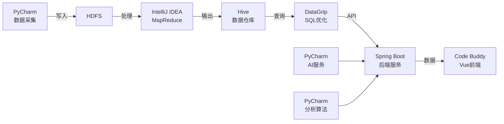

# 基金股票智能分析系统 - 开发环境说明文档

## 📋 目录概览与开发工具分配

本文档详细说明每个文件夹应在哪个开发环境中操作，帮助你高效进行系统开发。

> **开发节奏变更**: 本系统采用 **1周MVP冲锋计划** 而非原16周方案。下方所有模块依然照常开发，但时间安排改为每天并行推进多个模块。

---

## 🗂️ 完整目录结构与开发工具映射

```
A_system/
│
├── 📁 data-collector/                    【PyCharm】Python数据采集模块
│   ├── 📁 crawler/                       - 爬虫脚本（Scrapy/Selenium）
│   ├── 📁 api/                           - API调用模块（东方财富/同花顺/新浪）
│   ├── 📁 scheduler/                     - 定时任务调度（Airflow/crontab）
│   ├── 📁 utils/                         - 工具函数（数据校验、日志）
│   ├── 📁 tests/                         - 单元测试
│   ├── requirements.txt                  - Python依赖包
│   └── README.md                         - 模块说明
│
├── 📁 bigdata-processing/                【IntelliJ IDEA + PyCharm】大数据处理模块
│   ├── 📁 mapreduce/                     【IntelliJ IDEA】MapReduce作业（Java）
│   │   ├── 📁 src/main/java/
│   │   │   └── 📁 com/stock/mr/
│   │   │       ├── StockYearlyReturn.java    - 年收益率计算
│   │   │       ├── TechnicalIndicator.java   - 技术指标计算
│   │   │       └── VolumeAnalysis.java       - 成交量分析
│   │   └── pom.xml                       - Maven配置
│   │
│   ├── 📁 spark/                         【PyCharm】Spark作业（Python/Scala）
│   │   ├── 📁 streaming/                 - Spark Streaming实时计算
│   │   │   ├── realtime_indicator.py     - 实时指标计算
│   │   │   └── kafka_consumer.py         - Kafka数据消费
│   │   ├── 📁 sql/                       - Spark SQL查询
│   │   │   └── hive_query.py             - Hive数据仓库查询
│   │   └── 📁 mllib/                     - 机器学习模型
│   │       └── prediction_model.py       - 价格预测模型
│   │
│   ├── 📁 hive/                          【DataGrip】Hive数据仓库
│   │   ├── 📁 ddl/                       - 建表脚本
│   │   │   ├── stock_basic.sql           - 股票基本信息表
│   │   │   ├── stock_daily.sql           - 日K线数据表（分区）
│   │   │   ├── fund_info.sql             - 基金信息表
│   │   │   └── user_behavior.sql         - 用户行为表
│   │   ├── 📁 dml/                       - 数据操作脚本
│   │   │   ├── load_data.sql             - 数据加载
│   │   │   └── partition_manage.sql      - 分区管理
│   │   └── 📁 udf/                       【IntelliJ IDEA】自定义函数（Java）
│   │       ├── ChanFractalUDF.java       - 缠论分型UDF
│   │       ├── ChanPenUDF.java           - 缠论笔UDF
│   │       └── pom.xml                   - Maven配置
│   │
│   ├── 📁 scripts/                       【PyCharm】数据处理脚本
│   │   ├── data_cleaning.py              - 数据清洗（缺失值、异常值）
│   │   ├── data_transform.py             - 数据转换
│   │   └── etl_pipeline.py               - ETL流程
│   │
│   └── README.md                         - 模块说明
│
├── 📁 backend/                           【IntelliJ IDEA】Spring Boot后端服务
│   ├── 📁 src/
│   │   ├── 📁 main/
│   │   │   ├── 📁 java/com/stock/
│   │   │   │   ├── 📁 config/            - 配置类
│   │   │   │   │   ├── HadoopConfig.java     - Hadoop配置
│   │   │   │   │   ├── RedisConfig.java      - Redis配置
│   │   │   │   │   └── WebSocketConfig.java  - WebSocket配置
│   │   │   │   │
│   │   │   │   ├── 📁 controller/        - 控制器层
│   │   │   │   │   ├── UserController.java   - 用户管理
│   │   │   │   │   ├── StockController.java  - 行情服务
│   │   │   │   │   ├── AnalysisController.java - 分析服务
│   │   │   │   │   ├── AiDialogueController.java - AI对话
│   │   │   │   │   └── FavoriteController.java - 自选管理
│   │   │   │   │
│   │   │   │   ├── 📁 service/           - 业务逻辑层
│   │   │   │   │   ├── 📁 impl/
│   │   │   │   │   ├── UserService.java
│   │   │   │   │   ├── StockService.java
│   │   │   │   │   ├── AnalysisService.java
│   │   │   │   │   ├── AIDialogueService.java - 多AI融合
│   │   │   │   │   └── FavoriteService.java
│   │   │   │   │
│   │   │   │   ├── 📁 mapper/            - 数据访问层（MyBatis Plus）
│   │   │   │   │   ├── UserMapper.java
│   │   │   │   │   ├── StockMapper.java
│   │   │   │   │   └── FavoriteMapper.java
│   │   │   │   │
│   │   │   │   ├── 📁 entity/            - 实体类
│   │   │   │   │   ├── User.java
│   │   │   │   │   ├── Stock.java
│   │   │   │   │   ├── StockDaily.java
│   │   │   │   │   └── Favorite.java
│   │   │   │   │
│   │   │   │   ├── 📁 dto/               - 数据传输对象
│   │   │   │   │   ├── StockDTO.java
│   │   │   │   │   ├── AIRequest.java
│   │   │   │   │   └── AIResponse.java
│   │   │   │   │
│   │   │   │   ├── 📁 vo/                - 视图对象
│   │   │   │   │   ├── StockVO.java
│   │   │   │   │   └── AnalysisResultVO.java
│   │   │   │   │
│   │   │   │   ├── 📁 websocket/         - WebSocket推送
│   │   │   │   │   ├── StockWebSocketHandler.java
│   │   │   │   │   └── AiDialogueWebSocketHandler.java
│   │   │   │   │
│   │   │   │   ├── 📁 security/          - Spring Security配置
│   │   │   │   │   ├── SecurityConfig.java
│   │   │   │   │   └── JwtTokenFilter.java
│   │   │   │   │
│   │   │   │   └── StockApplication.java - 启动类
│   │   │   │
│   │   │   └── 📁 resources/
│   │   │       ├── 📁 mapper/            - MyBatis XML映射文件
│   │   │       ├── application.yml       - 应用配置
│   │   │       ├── application-dev.yml   - 开发环境配置
│   │   │       └── application-prod.yml  - 生产环境配置
│   │   │
│   │   └── 📁 test/                      - 单元测试
│   │       └── 📁 java/com/stock/
│   │
│   ├── pom.xml                           - Maven依赖配置
│   └── README.md                         - 模块说明
│
├── 📁 frontend/                          【VS Code】Vue 3前端应用
│   ├── 📁 src/
│   │   ├── 📁 assets/                    - 静态资源
│   │   │   ├── 📁 images/
│   │   │   ├── 📁 styles/
│   │   │   │   ├── variables.scss        - CSS变量
│   │   │   │   └── global.scss           - 全局样式
│   │   │   └── 📁 icons/                 - SVG图标
│   │   │
│   │   ├── 📁 components/                - 公共组件
│   │   │   ├── 📁 common/
│   │   │   │   ├── Header.vue            - 顶部导航
│   │   │   │   ├── Sidebar.vue           - 侧边栏
│   │   │   │   └── Footer.vue            - 底部
│   │   │   │
│   │   │   ├── 📁 chart/                 - 图表组件
│   │   │   │   ├── KLineChart.vue        - K线图
│   │   │   │   ├── LineChart.vue         - 折线图
│   │   │   │   └── BarChart.vue          - 柱状图
│   │   │   │
│   │   │   └── 📁 ai/                    - AI对话组件
│   │   │       ├── ChatWindow.vue        - 聊天窗口
│   │   │       └── MessageBubble.vue     - 消息气泡
│   │   │
│   │   ├── 📁 views/                     - 页面视图
│   │   │   ├── HomeView.vue              - 首页
│   │   │   ├── StockListView.vue         - 股票列表
│   │   │   ├── StockDetailView.vue       - 股票详情
│   │   │   ├── FundListView.vue          - 基金列表
│   │   │   ├── AnalysisView.vue          - 智能分析
│   │   │   ├── AiDialogueView.vue        - AI对话
│   │   │   ├── FavoriteView.vue          - 自选管理
│   │   │   └── UserCenterView.vue        - 用户中心
│   │   │
│   │   ├── 📁 router/                    - 路由配置
│   │   │   └── index.ts
│   │   │
│   │   ├── 📁 stores/                    - Pinia状态管理
│   │   │   ├── user.ts                   - 用户状态
│   │   │   ├── stock.ts                  - 股票状态
│   │   │   └── ai.ts                     - AI对话状态
│   │   │
│   │   ├── 📁 api/                       - API接口封装
│   │   │   ├── request.ts                - Axios封装
│   │   │   ├── user.ts                   - 用户接口
│   │   │   ├── stock.ts                  - 股票接口
│   │   │   ├── analysis.ts               - 分析接口
│   │   │   └── ai.ts                     - AI接口
│   │   │
│   │   ├── 📁 utils/                     - 工具函数
│   │   │   ├── format.ts                 - 格式化函数
│   │   │   ├── validator.ts              - 验证函数
│   │   │   └── storage.ts                - 本地存储
│   │   │
│   │   ├── 📁 types/                     - TypeScript类型定义
│   │   │   ├── stock.ts
│   │   │   ├── user.ts
│   │   │   └── ai.ts
│   │   │
│   │   ├── App.vue                       - 根组件
│   │   └── main.ts                       - 入口文件
│   │
│   ├── 📁 public/                        - 公共资源
│   │   └── favicon.ico
│   │
│   ├── index.html                        - HTML模板
│   ├── package.json                      - NPM依赖
│   ├── tsconfig.json                     - TypeScript配置
│   ├── vite.config.ts                    - Vite配置
│   └── README.md                         - 模块说明
│
├── 📁 ai-service/                        【PyCharm】AI对话服务
│   ├── 📁 app/
│   │   ├── 📁 api/                       - API路由
│   │   │   ├── dialogue.py               - 对话接口
│   │   │   └── analysis.py               - 分析接口
│   │   │
│   │   ├── 📁 models/                    - AI模型封装
│   │   │   ├── kimi_client.py            - Kimi AI客户端
│   │   │   ├── ant_client.py             - 蚂蚁AI客户端
│   │   │   └── eastmoney_client.py       - 东方财富AI客户端
│   │   │
│   │   ├── 📁 fusion/                    - 多AI结果融合
│   │   │   ├── fusion_algorithm.py       - 融合算法
│   │   │   └── confidence_calculator.py  - 置信度计算
│   │   │
│   │   ├── 📁 services/                  - 业务服务
│   │   │   ├── dialogue_service.py       - 对话服务
│   │   │   └── cache_service.py          - 缓存服务（Redis）
│   │   │
│   │   ├── 📁 utils/                     - 工具函数
│   │   │   ├── logger.py                 - 日志
│   │   │   └── validator.py              - 参数验证
│   │   │
│   │   ├── main.py                       - FastAPI应用入口
│   │   └── config.py                     - 配置文件
│   │
│   ├── 📁 tests/                         - 单元测试
│   ├── requirements.txt                  - Python依赖
│   └── README.md                         - 模块说明
│
├── 📁 analysis-algorithms/               【PyCharm】分析算法库
│   ├── 📁 chanlun/                       - 缠论分析算法
│   │   ├── fractal.py                    - 分型识别
│   │   ├── pen.py                        - 笔识别
│   │   ├── segment.py                    - 线段识别
│   │   ├── central.py                    - 中枢识别
│   │   └── signal.py                     - 买卖信号
│   │
│   ├── 📁 technical/                     - 技术指标计算
│   │   ├── ma.py                         - 移动平均线
│   │   ├── macd.py                       - MACD指标
│   │   ├── kdj.py                        - KDJ指标
│   │   ├── rsi.py                        - RSI指标
│   │   └── bollinger.py                  - 布林带
│   │
│   ├── 📁 quantitative/                  - 量化分析模型
│   │   ├── trend_analysis.py             - 趋势分析
│   │   ├── volatility.py                 - 波动率计算
│   │   ├── correlation.py                - 相关性分析
│   │   └── backtest.py                   - 回测框架
│   │
│   ├── 📁 utils/                         - 工具函数
│   │   ├── data_loader.py                - 数据加载
│   │   └── visualizer.py                 - 可视化
│   │
│   ├── 📁 tests/                         - 单元测试
│   ├── requirements.txt                  - Python依赖
│   └── README.md                         - 模块说明
│
├── 📁 docker/                            【任意文本编辑器】Docker环境配置
│   ├── 📁 hadoop/                        - Hadoop集群配置
│   │   ├── core-site.xml
│   │   ├── hdfs-site.xml
│   │   ├── yarn-site.xml
│   │   └── mapred-site.xml
│   │
│   ├── 📁 hive/                          - Hive配置
│   │   └── hive-site.xml
│   │
│   ├── 📁 spark/                         - Spark配置
│   │   └── spark-defaults.conf
│   │
│   ├── 📁 mysql/                         - MySQL初始化脚本
│   │   └── init.sql
│   │
│   ├── docker-compose.yml                - 服务编排
│   ├── Dockerfile.hadoop                 - Hadoop镜像
│   ├── Dockerfile.spark                  - Spark镜像
│   └── README.md                         - 部署说明
│
├── 📁 docs/                              【任意文本编辑器】项目文档
│   ├── 📁 design/                        - 设计文档
│   │   ├── architecture.md               - 系统架构设计
│   │   ├── database-design.md            - 数据库设计
│   │   └── api-design.md                 - API接口设计
│   │
│   ├── 📁 deployment/                    - 部署文档
│   │   ├── environment-setup.md          - 环境搭建
│   │   ├── hadoop-deployment.md          - Hadoop部署
│   │   └── production-deploy.md          - 生产部署
│   │
│   ├── 📁 testing/                       - 测试文档
│   │   ├── unit-test.md                  - 单元测试
│   │   └── performance-test.md           - 性能测试
│   │
│   └── README.md                         - 文档索引
│
├── 📁 data/                              【Git忽略】数据目录
│   ├── 📁 raw/                           - 原始数据（不提交Git）
│   ├── 📁 processed/                     - 清洗后数据（不提交Git）
│   ├── 📁 samples/                       - 示例数据（可提交Git）
│   └── .gitkeep
│
├── 📁 scripts/                           【PyCharm + PowerShell】运维脚本
│   ├── start-all.sh                      - 启动所有服务
│   ├── stop-all.sh                       - 停止所有服务
│   ├── deploy.sh                         - 部署脚本
│   ├── backup.sh                         - 数据备份
│   └── monitor.sh                        - 监控脚本
│
├── 📁 logs/                              【Git忽略】日志目录
│   ├── 📁 backend/
│   ├── 📁 ai-service/
│   ├── 📁 hadoop/
│   └── .gitkeep
│
├── .gitignore                            - Git忽略配置
├── .env.example                          - 环境变量模板
├── LICENSE                               - 许可证
├── README.md                             - 项目总览
├── CONTRIBUTING.md                       - 贡献指南（Git规范）
└── 基金股票智能分析系统 - 毕业设计技术指导文档.md - 技术指导文档
```

---

## 🛠️ 开发工具分配总览

### 硬件要求
- **内存**: 建议16GB+（同时运行Docker容器和多个IDE）
- **硬盘**: SSD硬盘加速大数据处理
- **CPU**: 多核处理器提升并行计算性能

---

### 软件安装顺序建议

按照以下顺序安装配置，确保环境依赖正确：

1. **Docker Desktop** - 基础容器环境
2. **DataGrip** - 数据库管理工具
3. **PyCharm Professional** - Python开发环境
4. **IntelliJ IDEA Ultimate** - Java开发环境
5. **Code Buddy** - 前端开发环境
6. **Anaconda** - Python环境管理
7. **Git** - 版本控制系统
8. **Postman/Apifox** - API接口测试

---

### 1️⃣ **PyCharm Professional** （Python开发）

**负责模块：**
- ✅ `data-collector/` - 数据采集（爬虫、API调用）
- ✅ `bigdata-processing/spark/` - Spark作业（Python）
- ✅ `bigdata-processing/scripts/` - 数据处理脚本
- ✅ `ai-service/` - AI对话服务（FastAPI）
- ✅ `analysis-algorithms/` - 分析算法库（缠论、技术指标、量化）
- ✅ `scripts/` - 运维脚本

**主要用途：**
- Python代码编写与调试
- 虚拟环境管理（Anaconda）
- Jupyter Notebook数据分析
- 数据库连接（MySQL/Hive/HBase）
- Git版本控制

**推荐插件：**
- Database Navigator（数据库管理）
- Hadoop Support（Hadoop支持）
- Markdown Support（文档编辑）

---

### 2️⃣ **IntelliJ IDEA Ultimate** （Java开发）

**负责模块：**
- ✅ `backend/` - Spring Boot后端服务
- ✅ `bigdata-processing/mapreduce/` - MapReduce作业（Java）
- ✅ `bigdata-processing/hive/udf/` - Hive自定义函数（Java）

**主要用途：**
- Java/Spring Boot开发
- Maven项目管理
- 数据库工具（DataGrip集成）
- RESTful API测试
- Git版本控制

**推荐插件：**
- Spring Boot Helper
- MyBatisX（MyBatis增强）
- Lombok
- Maven Helper

---

### 3️⃣ **Code Buddy** （前端开发）

**负责模块：**
- ✅ `frontend/` - Vue 3前端应用

**主要用途：**
- Vue 3 + TypeScript开发
- 实时预览（Vite热更新）
- ESLint代码检查
- Git版本控制

**必装插件：**
- Vue Language Features (Volar)
- TypeScript Vue Plugin (Volar)
- ESLint
- Prettier
- Auto Rename Tag
- Path Intellisense
- Chinese (Simplified) Language Pack

---

### 4️⃣ **DataGrip** （数据库管理）

**负责模块：**
- ✅ `bigdata-processing/hive/ddl/` - Hive建表脚本
- ✅ `bigdata-processing/hive/dml/` - Hive数据操作
- ✅ `backend/src/main/resources/mapper/` - MyBatis SQL优化

**连接的数据库：**
- MySQL 8.0（业务数据）
- Hive 3.x（数据仓库）
- HBase 2.x（实时数据）
- Redis 7.x（缓存）

**主要用途：**
- SQL编写与执行
- 数据库表结构设计
- 查询性能分析
- 数据导入导出

---

### 5️⃣ **Docker Desktop** （容器化环境）

**负责模块：**
- ✅ `docker/` - 大数据环境配置

**启动的服务：**
- Hadoop NameNode/DataNode
- Hive Server
- Spark Master/Worker
- MySQL
- Redis
- ZooKeeper

**常用命令：**
```powershell
# 启动所有服务
cd docker
docker-compose up -d

# 查看服务状态
docker-compose ps

# 查看日志
docker-compose logs -f namenode

# 停止服务
docker-compose down
```

---

### 6️⃣ **Postman / Apifox** （API测试）

**测试接口：**
- Backend RESTful API
- AI Service API

**主要用途：**
- 接口调试
- 自动化测试
- 接口文档生成

---

### 7️⃣ **Anaconda** （Python环境管理）

**用途：**
- Python虚拟环境管理
- 数据科学库安装
- Jupyter Notebook支持

**常用命令：**
```powershell
# 创建Python 3.8环境
conda create -n stock python=3.8

# 激活环境
conda activate stock

# 安装依赖
pip install scrapy pandas requests pyspark talib numpy

# 导出环境配置
conda env export > environment.yml
```

**PyCharm集成：**
- File → Settings → Project → Python Interpreter
- 选择Conda Environment → Existing Environment
- 指向 `anaconda3/envs/stock/python.exe`

---

### 8️⃣ **Git** （版本控制）

**分支策略：**
- `main` - 主分支（可交付状态）
- `feature/<描述>` - 功能开发
- `bugfix/<描述>` - Bug修复
- `wip/<描述>` - 实验性工作

**提交规范：**
```bash
# 功能新增
git commit -m "feat: add stock crawler module"

# Bug修复
git commit -m "fix: resolve null pointer exception"

# 文档更新
git commit -m "docs: update README with API examples"

# 构建/工具修改
git commit -m "chore: update dependencies"
```

**常用工作流：**
```powershell
# 创建并切换分支
git checkout -b feature/add-crawler

# 推送并设置上游
git push -u origin feature/add-crawler

# 同步主干并rebase
git fetch origin
git rebase origin/main

# Squash合并到main
git checkout main
git merge --squash feature/add-crawler
git commit -m "feat: add crawler module"

# 打tag标记里程碑
git tag -a v0.1.0 -m "论文提交版 2026-05-07"
git push origin v0.1.0
```

详细Git规范请参考 [CONTRIBUTING.md](file:///F:/bs/A_system/CONTRIBUTING.md)

---

## 📝 开发工作流建议

### 1周冲锋版开发流程

```
Day 1 [环境]         Docker启动 → 后端骨架 → 数据库设计 → 前端初始化
Day 2 [数据通道]      数据采集 → Hive建表 → CRUD API → 前端布局
Day 3 [大数据]        MapReduce → Hive分析 → Spark脚本 → 分析API
Day 4 [算法]          缠论 → 技术指标 → 量化模型
Day 5 [前端]          K线图 → 股票页面 → 基金页面
Day 6 [AI+集成]       AI服务 → 前后端联调 → 全链路打通
Day 7 [收尾]          测试修复 → 文档完善 → 演示准备
```

### 日常开发流程



### 分支管理策略

参考 `CONTRIBUTING.md`，使用以下分支：

```bash
# 功能开发
git checkout -b feature/add-crawler          # PyCharm
git checkout -b feature/backend-api          # IntelliJ IDEA
git checkout -b feature/frontend-page        # Code Buddy

# Bug修复
git checkout -b bugfix/fix-null-pointer

# 合并到main
git checkout main
git merge --squash feature/xxx
git tag -a v0.1.0 -m "里程碑版本"
```

---

## 🚀 1周冲锋启动顺序

### Day 1: 环境搭建

```powershell
# 1. 启动Docker大数据环境
cd docker
docker-compose up -d

# 2. 验证Hadoop
docker exec -it namenode hdfs dfs -ls /

# 3. 验证Hive
docker exec -it hive-server beeline -u jdbc:hive2://localhost:10000
```

### Day 2: 数据采集

```python
# 在 data-collector/ 中开发
python crawler/eastmoney_crawler.py
python api/ths_api_client.py
```

### Day 3: 大数据处理

```bash
# MapReduce作业（IntelliJ IDEA）
mvn clean package
hadoop jar target/mr-job.jar StockYearlyReturn

# Spark作业（PyCharm）
python spark/streaming/realtime_indicator.py
```

### Day 4: 算法开发

```bash
# 缠论分析
python analysis-algorithms/chanlun/fractal.py

# 技术指标
python analysis-algorithms/technical/ma.py
```

### Day 5-6: 后端+前端+AI

```bash
# 后端
cd backend && mvn spring-boot:run

# 前端
cd frontend && npm install && npm run dev

# AI服务
cd ai-service && pip install -r requirements.txt && python app/main.py
```

### Day 7: 收尾

```bash
# 集成测试
curl http://localhost:8080/api/stock/000001

# 打标签
git tag -a v1.0.0 -m "1周冲锋交付版 2026-05-13"
git push origin v1.0.0
```

---

## 📊 各模块技术栈对照表

| 模块 | 主语言 | 开发工具 | 构建工具 | 测试框架 |
|------|--------|----------|----------|----------|
| data-collector | Python 3.8+ | PyCharm | pip | pytest |
| bigdata-processing/mapreduce | Java 11 | IntelliJ IDEA | Maven | JUnit |
| bigdata-processing/spark | Python/Scala | PyCharm | pip/sbt | pytest |
| bigdata-processing/hive | SQL + Java | DataGrip + IntelliJ | Maven | - |
| backend | Java 11 | IntelliJ IDEA | Maven | JUnit + Mockito |
| frontend | TypeScript | Code Buddy | npm/Vite | Vitest |
| ai-service | Python 3.8+ | PyCharm | pip | pytest |
| analysis-algorithms | Python 3.8+ | PyCharm | pip | pytest |

---

## 💡 开发技巧与注意事项

### 1. 开发环境联动流程

```
数据源 → PyCharm(采集) → HDFS → IntelliJ(MapReduce) → Hive 
→ PyCharm(Spark) → HBase/MySQL → IntelliJ(Spring Boot) 
→ Code Buddy(Vue前端)
```

### 2. 跨模块协作要点

**PyCharm优化：**
- 启用Database Navigator插件直接操作Hive
- 配置PySpark本地模式调试，再提交集群
- 使用Jupyter Notebook进行数据探索
- 配置Remote Debug连接Spark/Hadoop集群

**IntelliJ优化：**
- 安装Maven Helper加速依赖管理
- 启用Spring Boot DevTools热重载
- 配置Remote Debug连接Hadoop集群
- 启用MyBatisX插件提升SQL开发效率

**Code Buddy优化：**
- 配置Vite热更新实现前端实时预览
- 启用ESLint自动修复
- 安装Vue Devtools浏览器插件
- 禁用不必要的插件提升性能

**DataGrip优化：**
- 保存常用SQL片段
- 使用Schema对比功能
- 配置数据库连接池

### 3. Git提交规范

```bash
# PyCharm开发的模块
git commit -m "feat: add eastmoney crawler"

# IntelliJ开发的模块
git commit -m "feat: implement stock yearly return MR job"

# Code Buddy开发的模块
git commit -m "feat: add k-line chart component"
```

### 4. 调试技巧

- **PyCharm**: 使用Remote Debug连接Spark/Hadoop集群
- **IntelliJ**: 使用Spring Boot DevTools热重载
- **Code Buddy**: 使用Vue Devtools浏览器插件
- **DataGrip**: 直接执行Hive SQL查看结果

### 5. 性能优化

- PyCharm: 使用PySpark本地模式调试，再提交集群
- IntelliJ: 启用Maven离线模式加速构建
- Code Buddy: 禁用不必要的插件提升性能

---

## 📞 常见问题

### Q1: 如何同时打开多个IDE？
**A**: 完全可行！每个IDE负责不同模块，互不干扰。建议：
- PyCharm: 数据采集 + Spark + AI服务 + 算法
- IntelliJ IDEA: 后端 + MapReduce + Hive UDF
- Code Buddy: 前端
- DataGrip: 数据库管理（独立运行）

### Q2: 内存不够怎么办？
**A**: 
- Docker限制容器内存：`docker-compose.yml`中设置`mem_limit`
- IDE调整JVM参数：Help → Change Memory Settings
- 关闭不用的IDE实例

### Q3: 如何统一代码风格？
**A**: 
- Python: `.flake8` + `black`格式化
- Java: IntelliJ Code Style配置
- TypeScript: ESLint + Prettier
- 提交前运行`git pre-commit hook`

### Q4: 数据库连接配置在哪里？
**A**: 
- Backend: `backend/src/main/resources/application-dev.yml`
- PyCharm: Database工具窗口配置
- DataGrip: 新建连接时配置

---

## 🎯 毕业设计答辩准备

### 最终交付物检查清单

- [ ] `main`分支代码可正常运行
- [ ] 打tag: `git tag -a v1.0.0 -m "1周冲锋交付版 2026-05-13"`
- [ ] Docker环境一键启动
- [ ] 前后端联调成功
- [ ] AI对话功能可用
- [ ] 缠论分析结果正确
- [ ] 全系统端到端数据流打通
- [ ] 演示截图和录制准备好

### 演示流程

1. **启动环境**: `docker-compose up -d`
2. **启动后端**: IntelliJ运行`StockApplication`
3. **启动前端**: Code Buddy终端`npm run dev`
4. **启动AI服务**: PyCharm运行`main.py`
5. **浏览器访问**: `http://localhost:5173`
6. **演示功能**: 行情查看 → 智能分析 → AI对话

---

## 📚 参考资源

- Hadoop官方文档: https://hadoop.apache.org/docs/
- Spark官方文档: https://spark.apache.org/docs/latest/
- Spring Boot官方文档: https://spring.io/projects/spring-boot
- Vue 3官方文档: https://cn.vuejs.org/
- 缠论原著: 《缠中说禅：教你炒股票》

---

**祝毕业设计顺利！**

*最后更新: 2026-05-07 · 采用1周MVP冲锋计划*
